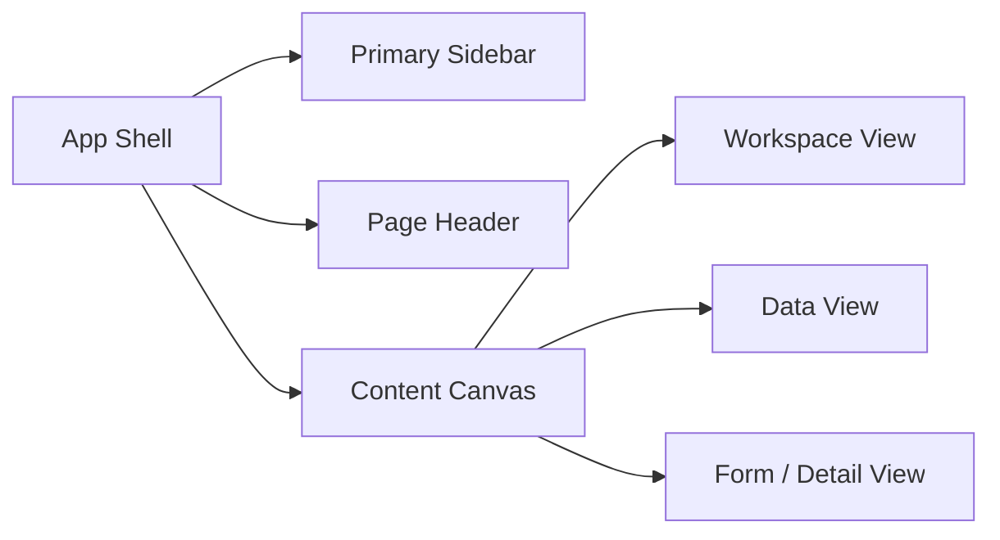

# Ops Platform Frontend Portal Redesign (V1)

Date: 2026-04-30  
Scope: User-facing portal redesign plan for the current embedded `/portal/` web UI  
Audience: Platform end users, operators, approvers, and administrators

## 1. Background

The current portal is already a functional unified entry for:

- CMDB asset browsing and editing
- SSH / RDP connectivity management
- Live sessions and session audit
- JIT bastion grants
- AWS account onboarding and sync
- IAM role binding and OIDC configuration

The shell, routing, and API integration are in place, but the product UX has
started to show the limits of a "single-page admin console" structure:

- top-level navigation is flat and cognitively heavy
- data-heavy pages mix browsing and editing in the same vertical flow
- feedback is mostly toast-based instead of being local to the current task
- the asset drawer has become an overloaded detail editor
- the sessions page wants to behave like a workspace, not a regular admin page
- `app.js` remains the dominant control plane, which slows down UI refinement

This document describes the next-stage redesign for the portal as a real
user-facing product, not just an admin verification UI.

## 2. Redesign Goals

- Make the portal legible to first-time users within one screen.
- Reduce page-switching for the most common operational workflows.
- Separate browse, inspect, edit, and execute actions more clearly.
- Turn sessions into a true operator workspace.
- Preserve the current backend/API shape where possible.
- Keep the delivery model simple:
  - embedded static files
  - no mandatory frontend build framework in this phase
  - gradual refactor from current plain JS modules

## 3. Non-goals

- A full visual-brand overhaul unrelated to usability.
- Replacing the current static-asset delivery model with a SPA framework.
- Reworking backend permissions or API semantics in this document.
- Designing the alert center in detail before the alert module is implemented.

## 4. Current UX Problems

### 4.1 Information Architecture

- The primary navigation is too flat:
  - `Overview`, `Assets`, `Connectivity`, `Sessions`, `Grants`, `AWS`, `Access`, `My profile`
- Resource-oriented and platform-oriented concepts live at the same level.
- The user has to understand implementation terms such as `SSH proxies`
  before they understand the main jobs the platform supports.

### 4.2 Page Layout

- `Assets` mixes search, filtering, creation, and inspection in one long page.
- `Sessions` visually behaves like a page, but functionally behaves like a
  persistent working console.
- `Access` combines user management, role inspection, and OIDC configuration,
  which creates a very wide and uneven cognitive surface.
- The detail drawer is used as the answer to too many problems.

### 4.3 Interaction Model

- Success and failure states rely too much on transient toast messages.
- Long-running actions do not consistently expose local progress state.
- Filters do not clearly show "what is currently applied".
- Tables and trees do not consistently separate primary vs secondary actions.
- Auto-refresh is helpful for live state, but intrusive for audit browsing.

### 4.4 Frontend Maintainability

- `app.js` still owns state, routing, data fetching, rendering, and event
  registration for multiple domains.
- Many views are rendered by replacing large `innerHTML` blocks.
- Local component state can be lost on re-render.
- Fine-grained focus control and accessibility improvements become harder over time.

## 5. Proposed Information Architecture

The portal should move from a flat "module list" to a grouped product IA.

### 5.1 Top-level Navigation

- `Overview`
- `Assets`
- `Sessions`
- `Access Requests`
- `Platform`
- `Profile`

### 5.2 Second-level Navigation

`Assets`
- Inventory
- Connectivity

`Sessions`
- Live
- Audit

`Access Requests`
- My requests
- Pending approvals
- Active grants

`Platform`
- Cloud accounts
- IAM
- OIDC

This keeps the first level aligned with jobs users actually perform:

- find and inspect infrastructure
- connect to infrastructure
- request access
- administer the platform

### 5.3 Navigation Model

Recommended shell behavior:

- desktop:
  - left sidebar for top-level sections
  - horizontal sub-nav or segmented control inside the page header
- tablet/mobile:
  - top app bar
  - collapsible navigation drawer
  - compact page-level segmented controls

## 6. App Shell Redesign

### 6.1 Shell Structure



### 6.2 Shell Principles

- The sidebar should communicate product areas, not implementation details.
- The page header should always answer:
  - where am I
  - what is this page for
  - what can I do here now
- The main content area should support three layout modes:
  - `overview mode`
  - `data mode`
  - `workspace mode`

### 6.3 Page Width Strategy

- Standard pages:
  - constrained readable width
- Table-heavy pages:
  - wide layout
- Session workspace:
  - full-width layout

This replaces the current one-size-fits-all content width.

## 7. Page Redesign

## 7.1 Overview

### Current issues

- Useful as a system summary, but visually generic.
- Activity and health are present, but not tied strongly to next actions.

### Proposed layout

- hero metrics row
- "things needing attention" row
- system health panel
- recent activity panel

### Improvements

- promote actionable summaries:
  - failed sync
  - pending access requests
  - recent failed probes
  - active sessions
- make metric cards clickable to relevant filtered pages

## 7.2 Assets

### Current issues

- Asset creation sits above the inventory, increasing first-screen weight.
- Filters are useful but visually dense.
- Tree/list toggle is good, but the overall page still behaves as one large block.
- The drawer has become the real asset workspace, but without internal navigation.

### Proposed layout

```text
Assets
├─ Header: search, quick actions, saved views
├─ Toolbar: applied filters, sort, view mode
├─ Main split
│  ├─ Inventory pane
│  └─ Detail pane / drawer
└─ Optional modal / drawer for create asset
```

### Key improvements

- Move `Create asset` into a modal or right-side drawer.
- Add filter chips for currently applied conditions.
- Add saved views:
  - `Production`
  - `AWS imported`
  - `Critical assets`
  - `Bastion-capable`
- Introduce table row selection state instead of only "click row to open".
- Split asset detail into internal tabs:
  - `Summary`
  - `Connection`
  - `Probe`
  - `Relations`
  - `Metadata`

### Result

The page becomes an inventory workspace instead of a long admin form.

## 7.3 Connectivity

### Current issues

- Technically correct, but it exposes backend vocabulary too early.
- Bastions, proxies, host keys, and keypairs are all presented as siblings.

### Proposed direction

Keep this as a platform-operations area under `Assets > Connectivity` or
`Platform > Connectivity`, depending on final IA preference.

Subsections:

- Bastions
- SSH proxies
- Host key trust
- Keypairs

### Key improvements

- Add explanatory lead text per subsection:
  - what this thing is
  - when the operator should care
- Surface relationship links:
  - proxy -> target assets
  - keypair -> matching AWS key name usage
  - host key -> trust state / override window

## 7.4 Sessions

### Current issues

- This is the most product-like part of the portal, but it is still embedded
  in a generic page frame.
- Audit and live workflows are very different but share one page container.
- The asset picker sidebar is useful, but fixed-width and not user-adjustable.

### Proposed redesign

Turn `Sessions` into a dedicated operator workspace.

#### Desktop layout

```text
Sessions
├─ Left rail: connectable assets / search / env filters
├─ Main workspace
│  ├─ Live session tabs
│  ├─ Session toolbar
│  └─ Terminal / RDP canvas
└─ Secondary mode: audit browser
```

#### Interaction changes

- `Live` and `Audit` should feel like separate tools, not just tabs.
- The left asset rail should be collapsible and resizable.
- Auto-refresh should be:
  - enabled by default for `Live`
  - optional or manual for `Audit`
- Audit should support:
  - pinned filters
  - session status filters
  - quick replay action
  - "open related asset" action

### High-value additions

- reconnect / duplicate session actions already exist and should remain prominent
- session toolbar should show:
  - asset
  - protocol
  - connection status
  - grant state if relevant
- add per-session status badges that remain stable during reconnects

## 7.5 Access Requests

### Current issues

- The grants/request UI is good conceptually, but it sits as a standalone
  module next to everything else.
- The user mental model is "I need access", not "I need to go to Grants".

### Proposed redesign

Rename the area to `Access Requests`.

Subsections:

- `My requests`
- `Pending approvals`
- `Active grants`

### Key improvements

- Make "request access" available from:
  - asset detail
  - session connect failure
  - access request page
- Use clearer language:
  - request access
  - approve access
  - active access window
- Show lifecycle more explicitly:
  - requested
  - approved / rejected
  - active until
  - revoked / expired

## 7.6 Platform

This area groups operational administration tasks that are not core day-to-day
asset workflows.

### Cloud accounts

- AWS account list
- account add/edit
- sync status and history
- last successful sync per account
- failed sync diagnosis entry points

### IAM

- user list
- user detail / effective roles
- role catalog
- role permissions

### OIDC

- separate from day-to-day user-role operations
- configuration form with inline validation and safe defaults

### Why split IAM and OIDC

The current page mixes two different administrator jobs:

- managing who can do what
- configuring how people log in

These should share a product area, but not the same scroll surface.

## 7.7 Profile

### Proposed role

- "Who am I in this system?"
- current identity
- effective permissions
- recent access context

### Improvements

- Add clearer grouping:
  - identity
  - roles
  - permissions
  - active grants
- Make this a trust/debug page for end users, not just a data dump

## 8. Cross-cutting Interaction Design

## 8.1 Feedback Model

Use three layers of feedback:

- inline:
  - field errors
  - validation hints
  - local success state
- section-level:
  - sync status
  - list refresh state
  - empty/loading/error panels
- global:
  - toast only for short, non-blocking confirmations

### Rule

If the user is still looking at the component that triggered the action, the
feedback should appear inside that component first.

## 8.2 Loading States

Add explicit loading patterns:

- skeleton rows for tables
- placeholder cards for overview
- loading tree for session asset rail
- drawer skeleton for asset detail fetch

Avoid blank panels after a navigation or refresh.

## 8.3 Empty States

Current empty states exist, but should become more actionable.

Example patterns:

- no assets:
  - create one manually
  - or add an AWS account
- no sessions:
  - connect from Assets
  - or pick from the session rail
- no active grants:
  - request access from an asset

## 8.4 Filter UX

Introduce a standard filter pattern across data pages:

- query input
- compact filter row
- applied filter chips
- reset all
- optional saved views

This makes `Assets`, `Sessions Audit`, `Bastions`, and `Requests` feel like one system.

## 8.5 Action Hierarchy

Each data row or card should distinguish:

- primary action:
  - open detail
- secondary action:
  - connect
  - replay
  - approve
  - revoke
- utility action:
  - copy id
  - open related view

Avoid making the entire row carry all meanings at once.

## 8.6 Modal and Drawer Behavior

Standardize all overlays:

- focus trap
- Esc close
- backdrop close only when safe
- return focus to trigger element
- body scroll lock
- consistent header/action layout

## 8.7 Accessibility

Minimum target improvements:

- keyboard-complete tabs
- keyboard-complete drawers/modals
- explicit focus-visible styling
- aria-live region for important async status
- better row/action semantics for clickable tables and trees

## 9. Visual Direction

The visual language should remain operational and serious, but less generic.

### Principles

- keep high scan speed for dense data
- make primary actions visually obvious
- avoid "all panels look equal"
- create stronger hierarchy through spacing and section contrast

### Recommendations

- use stronger section separation between workspace, inspection, and config areas
- make headers less repetitive by adding page-specific status context
- reserve accent color for action and status, not for every highlighted surface
- use a more deliberate contrast strategy for terminals and session areas

## 10. Frontend Architecture Adjustments

The redesign is not only visual. It needs a small architecture cleanup to make
UI iteration sustainable.

## 10.1 Module Boundaries

Target split:

- `shell/`
  - auth gate
  - nav
  - view routing
  - theme
- `assets/`
  - inventory list/tree
  - asset detail
  - asset create
  - connection editor
- `sessions/`
  - live workspace
  - asset rail
  - audit list
  - replay
- `access/`
  - requests
  - approvals
  - grants
- `platform/`
  - aws accounts
  - sync status
  - iam users/roles
  - oidc settings
- `shared/`
  - toast
  - modal/drawer primitives
  - loading/empty/error states
  - formatters

## 10.2 Rendering Strategy

Near-term rule:

- keep current plain JS
- reduce full-page `renderShell()` dependence
- prefer view-local render/update functions
- move toward smaller DOM patching instead of replacing large `innerHTML` blocks

This is enough to unlock better focus retention and component-level busy states
without forcing a framework migration.

## 10.3 State Strategy

Split state into:

- global shell state
- per-view state
- ephemeral overlay state

Examples:

- global:
  - token, user, permissions, active view
- per-view:
  - asset filters, session audit filters, AWS sync state
- ephemeral:
  - drawer open, modal open, submitting, replay speed

## 11. Delivery Plan

## Phase 1: UX Foundation ✅ Shell + IA done (2026-04-30)

- introduce grouped IA in the shell ✅
- split `Platform` and `Access Requests` ✅
- move create forms out of top-of-page placement ⏳ (Phase 2 — Assets create modal)
- standardize page headers and filter bars ✅ for headers; filter chips deferred to Phase 2

### What landed

- Sidebar collapsed from 8 flat items (`Overview / Assets / Connectivity /
  Sessions / Grants / AWS / Access / My profile`) to 6 grouped sections
  (`Overview / Assets / Sessions / Access requests / Platform / Profile`).
- Subsections are rendered as a consistent strip injected after every
  page header by `renderSubNav()` — replaces ad-hoc per-page tab rows
  (e.g. the old `connectivity-tab-switcher` inside the Connectivity page,
  the Live/Audit switcher inside Sessions, and the stacked sections on
  the Grants page).
- Routing extracted to `internal/httpserver/ui/portal/modules/router.js`
  (per the redesign doc §10.1 `shell/` boundary). `setView(section,
  subsection)` is the only entry point; old single-string call sites
  resolve via `LEGACY_ROUTES`.
- URL hash routing: `#assets/inventory`, `#sessions/audit`,
  `#access/pending`, etc. Bookmarks and back/forward work.
- Per-section subsection persistence in `localStorage` so each section
  remembers the last subsection the user opened.
- Page headers updated: `Inventory` (was Assets), `Cloud accounts`
  (was AWS), `IAM` (was Access). Subtitles refined.
- `Access requests` page subtitle adapts per subsection (My requests vs
  Pending approvals vs Active grants).

### Deferred

- Filter chips, saved views, table row selection (Phase 2 — Assets
  workspace).
- Splitting the asset drawer into internal Summary/Connection/Probe/
  Relations/Metadata tabs (Phase 2).
- Sessions full-width workspace, sidebar collapse/resize (Phase 3).
- IAM ↔ OIDC split (Phase 4).
- Loading skeletons, modal/drawer focus discipline (Phase 5).

## Phase 2: Assets Workspace ✅ Core landed (2026-04-30)

- redesign inventory toolbar — partially: page-header search & view toggle
  preserved; create-asset moved out of top-of-page (see below)
- add applied filter chips and saved views — chips ✅; saved views deferred
- split asset drawer into internal sections/tabs ✅
- tighten row/action hierarchy — deferred (Phase 5 polish)

### What landed

- New shared modal primitive at `modules/modal.js`
  (`openModal({title, body, actions, size, dismissible, onClose})`) with
  Esc/backdrop dismiss, focus restore, and a per-action `setBusy(label)`
  helper. Replaces the ad-hoc replay/grant-request modal scaffolds over
  time; first consumer is the asset create form.
- "+ New asset" no longer pushes inventory below the fold. Form lives in
  the modal; the in-page `#asset-form-panel` is gone.
- Inventory now renders a chip strip above the table for every active
  filter (env, type, status, source, region, criticality, search,
  include-bastions). Each chip has its own × to clear that field; "Clear
  all" wipes the lot. Chips stay in sync with the toolbar selects.
- Asset drawer split into 5 tabs:
  Summary / Connection / Probe / Relations / Metadata. Connection and
  Probe tabs hide for non-connectable assets. Active tab is preserved on
  the in-memory `state.assetDrawer.tab` so a re-render keeps the user on
  the same pane, and tab-switching does not re-render unsaved form drafts.

### Deferred (Phase 5 / future)

- Saved views ("Production", "AWS imported", "Critical assets",
  "Bastion-capable") — needs concrete definition for each preset.
- Table row selection state (multi-select primitives, bulk actions).
- "Tighten row/action hierarchy" — primary/secondary/utility action split
  is mostly there; needs a polish pass for visual weights.

### Note on app.js cap

`scripts/check-deps.sh` raises the app.js LOC cap from 3 800 → 4 200 to
absorb Phase 2's structural code (modal primitive consumer + chip
renderer + drawer tabs). The eventual fix is the `assets/` module split
called out in §10.1; tracked as a follow-up.

## Phase 3: Sessions Workspace ✅ Core landed (2026-04-30)

- make sessions full-width ✅
- separate `Live` and `Audit` experiences more clearly ✅
- add sidebar collapse/resize ✅
- improve replay and audit filtering ✅

### What landed

- `.main` gets a `main-workspace` modifier the moment the user enters the
  Sessions section. Drops the centered max-width and the standard
  padding so the terminal canvas / audit table fills the viewport. The
  page-header still shows so the section sub-nav remains visible.
- The asset rail has a collapse button (left of the search input) and a
  drag-to-resize handle on its right edge. Width is clamped to 200–600
  px; both width and collapsed state persist in localStorage
  (`ops_platform_sessions_rail_*`).
- On the Audit subsection the rail is hidden via the new `audit-mode`
  layout class — the rail only exists to launch new sessions, so it
  carried no signal during audit browsing.
- Auto-refresh defaults are now subsection-aware: Live keeps the 10s
  poll; Audit pauses it. Refresh is one click via the toolbar button.
- Audit toolbar gains a status select (All / Active / Closed / Error) and
  filter chips for active conditions (user, asset, status). Each chip
  has its own × to clear that field; "Clear all" wipes the lot. The
  legacy `onlyActive` boolean still works — it now maps to
  `status === "active"`.
- Audit row "Replay" button replaced with an actions cell containing
  Replay (when a recording exists) and "Open asset", which sends the
  user back to the inventory drawer for that session's asset — useful
  during incident review.
- Empty-state copy now reflects whether a filter is active vs the table
  genuinely being empty.

### Deferred

- Session toolbar grant-state badge (mentioned in §7.4) — pending an
  authoritative way to surface the active grant from the live session
  toolbar.
- "Reconnect / duplicate session" prominence pass — already exists,
  visual weight pass left for Phase 5.

## Phase 4: Platform Admin ✅ Core landed (2026-05-01)

- split IAM and OIDC into separate subsections ✅
- improve AWS sync visibility and failure diagnosis ✅
- align table/form patterns across admin areas ✅ (AWS create now matches
  Phase 2 asset create — both via shared modal primitive)

### What landed

- New `view-oidc` article. SUB_NAV gains a third Platform pane:
  Cloud accounts | IAM | OIDC. The OIDC form moved out of the IAM page
  (where it shared scroll surface with user/role admin) and onto its own
  page with explanatory copy distinguishing "who can do what" (IAM) from
  "how people log in" (OIDC).
- "Add account" on Cloud accounts switched to the shared modal primitive,
  matching the Phase 2 Create-asset pattern. Inline `#aws-form-panel` is
  gone; the inventory above is no longer pushed below the fold each time
  someone opens the form.
- Cloud accounts table gains a "Last sync" column populated from the
  sync history. Each row shows a status pill + relative time. Failed
  rows surface a 1-line truncation of the error message and a "see
  history" link that scrolls to the sync history with the status filter
  pre-set to "failed".
- Sync history table gets a status filter (All / Success / Failed /
  Running). Failed runs show their error message inline as a sub-line
  under the resource type — no need to hover or open a separate panel
  to see what broke.

### Deferred

- Per-account drill-down (filter sync history to a single account by
  clicking the account name) — pattern established by the link from the
  Last-sync error cell, but not yet generalized.
- "Test connection" affordance on the AWS create form — needs a backend
  endpoint to dry-run STS:GetCallerIdentity before persisting.

### Note on app.js cap

`scripts/check-deps.sh` raises the app.js LOC cap from 4 200 → 4 500 to
absorb Phase 4's modal + sync-diagnosis code. This is the second bump
in two phases; Phase 5 should accompany its work with at least one
module extraction (likely `platform/` or `iam/`) so the cap can drop
back down.

## Phase 5: Interaction Quality

- loading skeletons
- accessibility pass
- modal/drawer consistency pass
- reduce toast overuse

## 12. Success Criteria

The redesign is successful when:

- a new user can find assets, request access, and start a session without
  being taught internal implementation vocabulary
- the `Assets` page feels like an inventory workspace, not a stacked admin form
- the `Sessions` page feels like an operator tool, not a normal content page
- administrators can manage AWS/IAM/OIDC without scrolling through unrelated controls
- frontend changes can be made per page/module without touching a central render path

## 13. Immediate Next Steps

- create low-fidelity wireframes for:
  - app shell
  - assets workspace
  - sessions workspace
  - platform admin area
- extract shared UI primitives:
  - modal
  - drawer
  - empty/loading/error state blocks
- start by refactoring `Assets` and `Sessions`, which have the highest UX leverage
